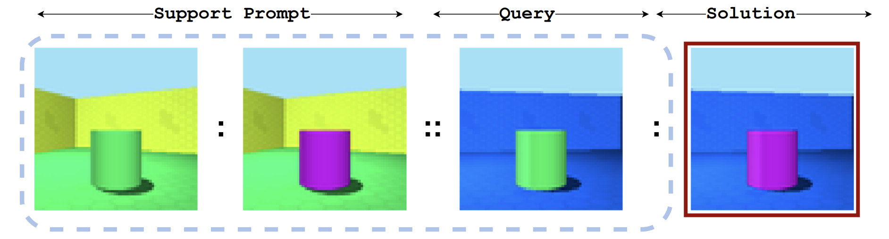
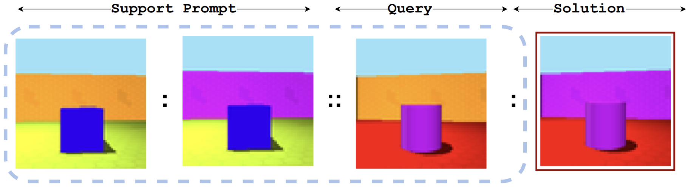
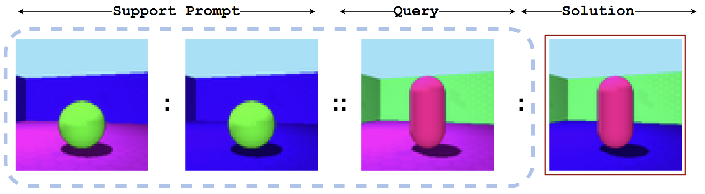
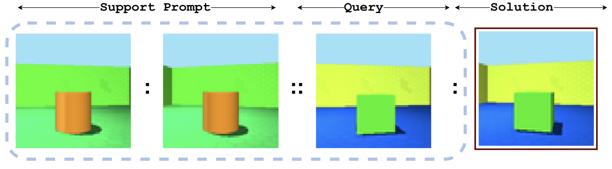
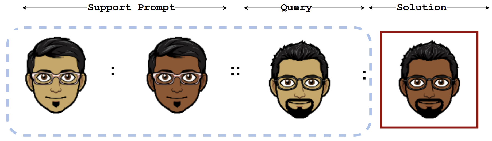
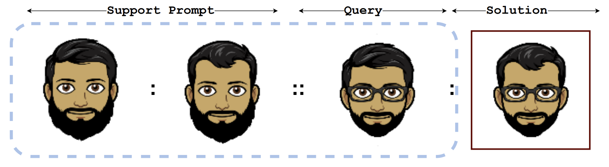
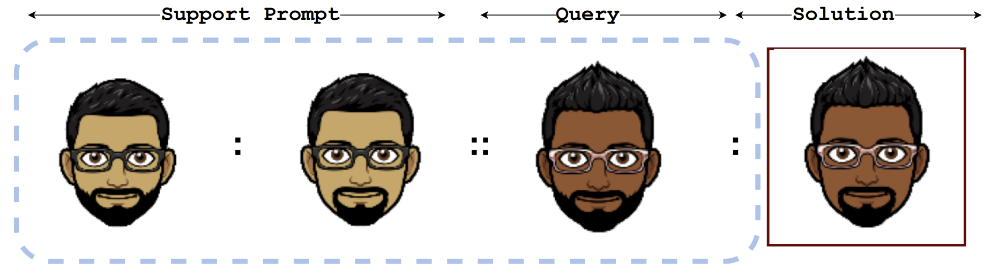
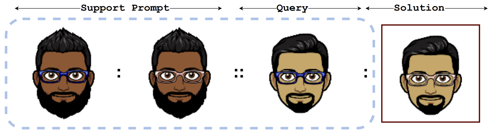
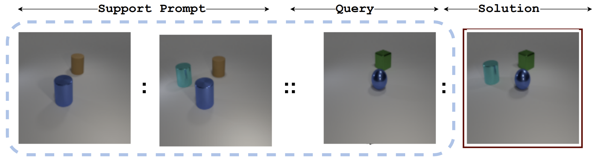
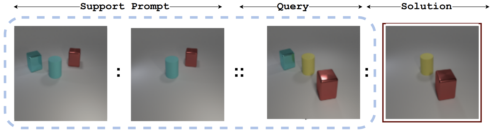

# Im-Promptu: Visual Analogy Suite

This folder contains the visual analogy tasks used for the paper **Im-Promptu: In-Context Composition from Image Prompts**. Each benchmark has been separately described below. Each visual analogy suite is divided into two broad kind of analogies depending on the underlying relation - *Primitive* and *Composite* tasks

(1) Primitive: A single image attribute is modified at a time. For example, the color of the object is changed from red to blue.

(2) Composite: Multiple image attributes are modified at a time. For example, the color of the object is changed from red to blue and the scene orientation is changed from -15 degrees to +15 degrees.

## Table of Contents
- [Im-Promptu: Visual Analogy Suite](#im-promptu-visual-analogy-suite)
  - [Table of Contents](#table-of-contents)
  - [3D Shapes Visual Analogy Benchmark](#3d-shapes-visual-analogy-benchmark)
    - [Description](#description)
    - [Examples](#examples)
    - [Jupyter Notebook](#jupyter-notebook)
  - [BitMoji Visual Analogy Benchmark](#bitmoji-visual-analogy-benchmark)
    - [Description](#description-1)
    - [Examples](#examples-1)
    - [Jupyter Notebook](#jupyter-notebook-1)
  - [CLEVr Visual Analogy](#clevr-visual-analogy)
    - [Description](#description-2)
    - [Examples](#examples-2)
  - [Cite this work](#cite-this-work)
    - [Jupyter Notebook](#jupyter-notebook-2)
  - [License](#license)


## 3D Shapes Visual Analogy Benchmark

The link to the benchmark is [here]() 

### Description

This dataset consists of static scenes of various objects lying on
a colored floor in front of a colored wall viewed from different orientations. To set up primitive tasks, we consider the four composable properties: {object color, wall color, floor color, scene orientation} 

<!-- insert table -->

> **Source**: [3D Shapes Dataset](https://github.com/deepmind/3d-shapes) <br/>
> **Primitive Task:** {Property} | {Domain Size} <br/>
>  &nbsp;&nbsp;&nbsp;&nbsp;&nbsp;&nbsp; Object Color -- 10<br/>
> &nbsp;&nbsp;&nbsp;&nbsp;&nbsp;&nbsp; Wall Color -- 10<br/>
>  &nbsp;&nbsp;&nbsp;&nbsp;&nbsp;&nbsp; Floor Color -- 10<br/>
> &nbsp;&nbsp;&nbsp;&nbsp;&nbsp;&nbsp; Scene Orientation -- 15<br/>
> **Examples per task:** 3 <br/>
> **Number of Training Tasks:** 80000 <br/>
> **Number of Primitive Extrapolation Tasks:** 1000 <br/>
> **Number of Composite Extrapolation Tasks:** 1000 $\forall$ k $\in$ {2,3,4} <br/>
 
### Examples 

<!-- insert images with caption -->



***<p style="text-align: center;">Primitive analogy that modifies the object color</p>***



***<p style="text-align: center;">Primitive analogy that modifies the wall color</p>***



***<p style="text-align: center;">Primitive analogy that modifies the floor color</p>***




***<p style="text-align: center;">Primitive analogy that modifies the scene orientation</p>***


### Jupyter Notebook

[This notebook](./3dshapes.ipynb) explains the dataset structure.


## BitMoji Visual Analogy Benchmark

The link to the benchmark is [here]()

### Description

BitMoji is an avatar creator service for social media users that
allows them to create intricate cartoon faces. We create visual analogies using four underlying dynamic elements of the avatar: {skin tone, hair type, facial hair type, eyewear type}.

> **Source**: [BitMoji API](https://www.bitmoji.com/) <br/>
> **Primitive Task:** {Property} | {Domain Size} <br/>
>  &nbsp;&nbsp;&nbsp;&nbsp;&nbsp;&nbsp; Skin Tone -- 3<br/>
> &nbsp;&nbsp;&nbsp;&nbsp;&nbsp;&nbsp; Hair Style -- 10<br/>
>  &nbsp;&nbsp;&nbsp;&nbsp;&nbsp;&nbsp; Facial Hair -- 5<br/>
> &nbsp;&nbsp;&nbsp;&nbsp;&nbsp;&nbsp; Eyewear -- 5<br/>
> **Examples per task:** 3 <br/>
> **Number of Training Tasks:** 80000 <br/>
> **Number of Primitive Extrapolation Tasks:** 1000 <br/>
> **Number of Composite Extrapolation Tasks:** 1000 $\forall$ k $\in$ {2,3} <br/>

### Examples




***<p style="text-align: center;">Primitive analogy that modifies the skin tone</p>***



***<p style="text-align: center;">Primitive analogy that modifies the hair style</p>***



***<p style="text-align: center;">Primitive analogy that modifies the beard style</p>***




***<p style="text-align: center;">Primitive analogy that modifies the eye wear type</p>***

### Jupyter Notebook

[This notebook](./bitmoji.ipynb) explains the dataset structure.


## CLEVr Visual Analogy

### Description

CLEVr is a popular visual question-answering dataset with
the visual component consisting of multiple objects lying in a scene. We use the CLEVr rendering
engine to set up primitive tasks that include adding and deleting the same object across various
scenes.

> **Source**: [CLEVr Dataset](https://arxiv.org/abs/1612.06890) <br/>
> **Primitive Task:** {Property} | {Domain Size} <br/>
>  &nbsp;&nbsp;&nbsp;&nbsp;&nbsp;&nbsp; Add object -- 1000<br/>
> &nbsp;&nbsp;&nbsp;&nbsp;&nbsp;&nbsp; Delete Object -- 1000<br/>
> **Examples per task:** 3 <br/>
> **Number of Training Tasks:** 55000 <br/>
> **Number of Primitive Extrapolation Tasks:** 1000 <br/>
> **Number of Composite Extrapolation Tasks:** 200 $\forall$ k $\in$ {2,3} <br/>

### Examples



***<p style="text-align: center;">Primitive analogy that adds an object</p>***



***<p style="text-align: center;">Primitive analogy that deletes an object</p>***


## Cite this work

Cite our work using the following bibtex entry:
```bibtex

@misc{dedhia2023impromptu,
      title={Im-Promptu: In-Context Composition from Image Prompts}, 
      author={Bhishma Dedhia and Michael Chang and Jake C. Snell and Thomas L. Griffiths and Niraj K. Jha},
      year={2023},
      eprint={2305.17262},
      archivePrefix={arXiv},
      primaryClass={cs.CV}
}
```

### Jupyter Notebook

[This notebook](./clevr.ipynb) explains the dataset structure.

## License

The Clear BSD License
Copyright (c) 2023, Bhishma Dedhia and Jha Lab.
All rights reserved.

See License file for more details.